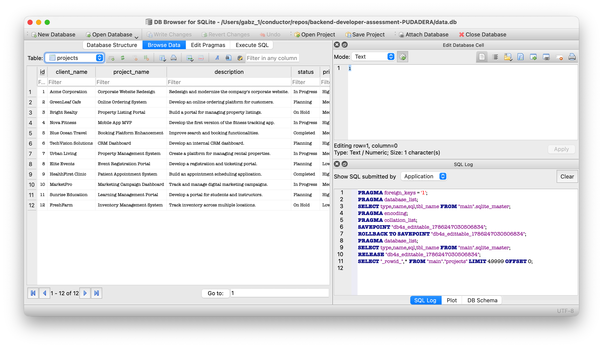
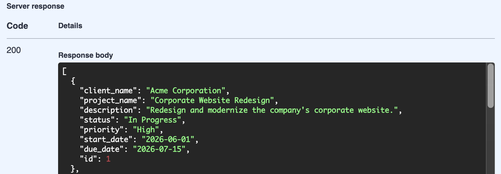

# Task Management Application

A code repository for a small REST API for tracking client projects (client name, status, priority, dates, etc.) built with FastAPI and SQLite. This was my submission for the backend developer assessment, covering the 5 CRUD endpoints and validation rules described in `docs/REQUIREMENTS.md`.

## Table of Contents

* [Setup Instructions](#setup-instructions)
* [Technology Choices](#technology-choices)
* [How to Run the Application](#how-to-run-the-application)
* [Assumptions Made](#assumptions-made)
* [Technical Reflection](#technical-reflection)

## Setup Instructions

You'll need Python 3.11+ installed.

```bash
# clone and enter the repo
git clone <this-repo-url>
cd backend-developer-assessment-PUDADERA

# (recommended) create a virtual environment
python3 -m venv .venv
source .venv/bin/activate

# install dependencies
pip install -r requirements.txt
```

## Technology Choices

I kept the stack small on purpose since this is a focused CRUD assessment, not a big system:

* **FastAPI** — I picked this over Flask/Django because it gives request validation "for free" through Pydantic models, and it auto-generates interactive API docs at Swagger through`/docs` endpoint , which made manual testing a lot faster while I was building.
* **SQLite** (via **SQLAlchemy**) — no external database server to set up, which keeps the project easy to run for anyone reviewing it. SQLAlchemy's ORM also let me define the `Project` model once and reuse it across the repository layer.
* **Pydantic** — used for request/response schemas (`ProjectCreate`, `ProjectUpdate`, `ProjectOut`) so bad input types (e.g. a string where a date is expected) get rejected automatically before my own validation logic even runs.
* **Layered architecture** (controllers → services → repositories → models) — I followed this pattern (laid out in `docs/ARCHITECTURE.md`) to keep HTTP concerns, business rules, and data access separate. It was new to me structuring a small project this way, but it made it much easier to know *where* a given piece of logic should live.

## How to Run the Application

**Option 1 — locally:**

```bash
# seed the database with sample data (creates data.db)
python scripts/seed.py

# start the dev server
uvicorn app.main:app --reload
```


The API will be running at `http://127.0.0.1:8000`. Interactive docs (Swagger UI) are at `http://127.0.0.1:8000/docs`.


**Option 2 — with Docker:**

```bash
docker compose up --build
```

This builds the image and starts the API on `http://127.0.0.1:8000`. On first boot, the container automatically seeds `data.db` from `test_data.json` — you don't need to run the seed script yourself. The database lives in a `./data` folder that gets mounted into the container, so your data survives even if you stop and remove the container and start it again later (it's only reset if you delete the `./data` folder yourself).

If port 8000 is already taken on your machine by something else, either stop that other container/process, or edit the port mapping in `docker-compose.yml` (e.g. `"8001:8000"`).

**Example requests**, once the server is running:

```bash
curl http://127.0.0.1:8000/projects
curl http://127.0.0.1:8000/projects/1
curl -X POST http://127.0.0.1:8000/projects \
  -H "Content-Type: application/json" \
  -d '{"client_name":"Acme","project_name":"New Site","status":"Planning","priority":"Low","start_date":"2026-01-01","due_date":"2026-02-01"}'
```


## Assumptions Made

The requirements left a few things open to interpretation, so here's what I decided and why:

* **Status and Priority are plain strings checked against a fixed set** (`{"Planning", "In Progress", "On Hold", "Completed"}` and `{"Low", "Medium", "High"}`) rather than a formal Python `enum.Enum`. This was a shortcut on my part to move faster — a real enum would give better editor autocomplete and a single source of truth, and I'd want to change this with more time.
* **Validation lives in the service layer**, not in the Pydantic schemas or the controller. I made this call so the rules from the requirements (e.g. "due date can't be before start date," which needs two fields compared together) live in one obvious place instead of being split across the framework's built-in validation and my own code.
* **No authentication** — For the authentication, there hasn't been a rule to follow so I just ignored it
* **Update (`PUT`) requires the full object**, not a partial patch so I didn't implement `PATCH`-style partial updates since the requirements described `PUT /projects/:id` as "update," and I didn't want to guess at merge behavior for missing fields.

## Technical Reflection

### 1. Why did you choose this implementation approach?

I followed the layered architecture (controller → service → repository → model) for this project because it's a pattern I wanted to get more practice with. Doing things this way means each had one clear job: the controller just handles HTTP, the service holds the business rules and the repository is the only connection to the database.

### 2. What tradeoffs did you make?

The biggest one is that my service layer raises FastAPI's `HTTPException` directly instead of raising plain Python/domain exceptions that a controller would translate into HTTP responses. It was faster to write and kept the code short, but it means the service layer isn't fully independent of the web framework. 

### 3. What would you improve if given additional time?

If I would have more time I would add unit tests for each of the service and repository layers (I only tested manually via curl and Swagger UI, which doesn't scale and isn't repeatable). 

I would also turn Status/Priority into real enums; add pagination and filtering to `GET /projects`. I would also add a global exception handler so an unexpected server error returns a safe generic 500 instead of possibly leaking a stack trace; and decouple the service layer from FastAPI's `HTTPException` as mentioned above.

### 4. What was the most challenging part of this assessment?

The layered structure took me the longest to wrap my head around. Writing the actual CRUD stuff was easy, but I kept getting stuck on where things should live — like, should the date-range check go in the Pydantic schema, or does that belong in the service layer? I went back and forth on that a few times before settling on an answer.

The Docker setup gave me a headache too. My seed script kept failing and I couldn't figure out why until I realized Docker was creating an empty *directory* at the mount path instead of treating it as a file because that path didn't exist in the image yet. Once I understood that, the fix was easy: just mount the parent directory instead of pointing straight at the database file.

### 5. Did you use AI tools during development?

Yeah, I used Claude Code the whole way through. It helped me scaffold the layered project structure and wrote a first pass at the CRUD endpoints and validation logic, which I then went through and adjusted myself. I also leaned on it to help set up and debug the Docker config, including tracking down the volume-mount issue mentioned above. I didn't just trust the output though — I tested everything myself with curl and the `/docs` Swagger UI before considering it done.

Whenever I hit a roadblock I didn't fully understand, I used a mentoring-style, Socratic approach with it instead of just asking for the fix — getting asked questions back until I could explain the problem myself. That kept me from copy-pasting solutions I couldn't defend, and it's the same habit I want to keep leaning on so I can work through roadblocks on my own next time.
