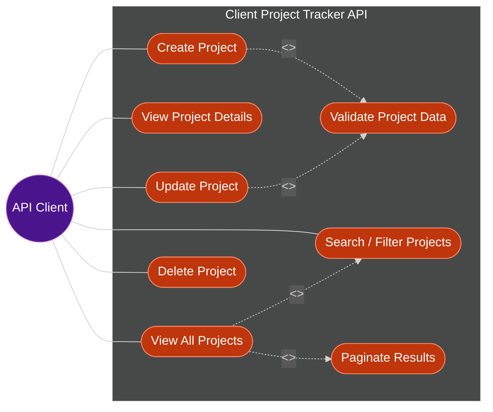

# Use Case Diagram

Generated from `docs/REQUIREMENTS.md`.

## Actors

| Actor      | Description                                                                                                                                                        |
| :--------- | :------------------------------------------------------------------------------------------------------------------------------------------------------------------ |
| API Client | Any consumer of the REST API (frontend app, script, or third-party tool) performing project CRUD operations. Requirements define a single actor; no roles specified. |

## Use Cases

| ID  | Use Case                 | Description                                                                                                                              | Actor(s)   |
| :-- | :------------------------ | :----------------------------------------------------------------------------------------------------------------------------------------- | :--------- |
| UC1 | View All Projects         | `GET /projects` — retrieve the list of all projects                                                                                        | API Client |
| UC2 | View Project Details      | `GET /projects/:id` — retrieve a single project by ID                                                                                       | API Client |
| UC3 | Create Project             | `POST /projects` — create a new project record                                                                                             | API Client |
| UC4 | Update Project             | `PUT /projects/:id` — update an existing project                                                                                            | API Client |
| UC5 | Delete Project             | `DELETE /projects/:id` — remove a project                                                                                                   | API Client |
| UC6 | Validate Project Data      | Enforce required fields (Client Name, Project Name), valid Status/Priority, and Due Date ≥ Start Date; returns meaningful error messages   | —          |
| UC7 | Search / Filter Projects   | Bonus: search projects and filter by status or priority                                                                                     | API Client |
| UC8 | Paginate Results           | Bonus: paginate the project list response                                                                                                   | —          |

Notes:

- UC6 is modeled as `<<include>>` in Create and Update since validation is mandatory per `docs/REQUIREMENTS.md`.
- UC7/UC8 are modeled as `<<extend>>` on View All Projects since Pagination, Search, and Filtering are listed under "Bonus (Optional)", not core endpoints.
- Authentication and Unit Tests are also bonus items but aren't modeled as use cases — no distinct actor/role is defined in the requirements.
